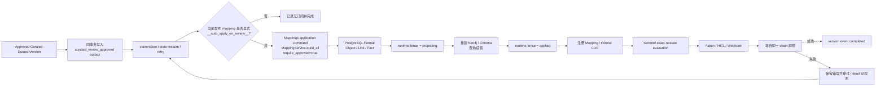
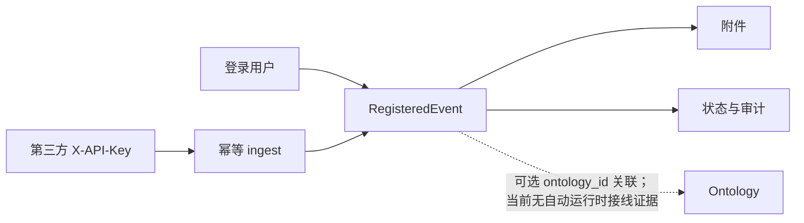

# 核心数据流

本页描述当前源码已经接通的三条生产链路。它们共享版本与发布契约，但不是一条
可以任意跳步的线性流程。详细状态门、权限、幂等与回滚要求见
[核心运行契约](../product/requirements/0002-core-data-ontology-runtime-contract.md)。

## 1. 数据生产

```mermaid
flowchart LR
  Source["外部源 / 上传 / 手工数据"] --> Dataset["Dataset + immutable DatasetVersion"]
  Dataset --> Draft["Pipeline draft"]
  Draft --> DryRun["dry-run / preview"]
  DryRun --> Attestation["定义校验凭据"]
  Attestation --> Published["immutable PipelineVersion\nstatus=published"]
  Published --> Enabled["enabled=true"]
  Enabled --> Run["production run"]
  Run --> Curated["稳定产物身份\npipeline_id + output_key"]
  Curated --> CuratedVersion["新的 Curated DatasetVersion"]
  CuratedVersion --> Review["绑定该版本的 admin review"]
  Review -->|approve| Approved["Approved Version"]
  Review -->|reject| Rejected["Rejected Version"]
```

关键边界：

- 数据更新创建新版本，不覆盖旧版本；
- Canvas 发布凭据绑定当前定义和 dry-run，定义变化会使旧凭据失效；
- 发布和启用分开；生产运行同时要求 published、enabled，并校验发布快照；
- 成品身份使用 `(producer_pipeline_id, output_key)`，不把可变名称当主键；
- 审核绑定精确版本，新版本不能复用旧版本的 approved 结论。

实现入口：
[`datasets/`](../../backend/app/data_channel/datasets/)、
[`pipelines/`](../../backend/app/data_channel/pipelines/)、
[`pipeline_run.py`](../../backend/app/tasks/v2/pipeline_run.py)、
[`curated/`](../../backend/app/data_channel/curated/)。

### 已登记的直接采集例外

[`collectors_router.py`](../../backend/app/data_channel/connections/collectors_router.py)
是一条现存兼容路径：它没有创建 DatasetVersion，也不经过 Pipeline、Curated
review 或 Mapping，而是在本体/release 锁内直接写运行时 Object、Link 和 Fact。
当前前端只定义了 collector API client，生产 import 图中没有可见 UI 调用。
因此它不能作为标准数据链路的捷径；迁移前必须单独验证 release fence、类型
完整性和事实来源 `collector://aihot`。行为覆盖见
[`test_collector_type_integrity.py`](../../backend/tests/data_channel/test_collector_type_integrity.py)。

## 2. 本体定义发布

```mermaid
flowchart LR
  Create["创建 Ontology"] --> V0["immutable v0 release\ncurrent_release_id"]
  Current["当前 immutable release"] --> Draft["从完整快照创建 draft"]
  V0 --> Draft
  Draft --> Edit["编辑 structure / mappings / sentinels"]
  Edit --> Revision["revision + snapshot hash\n旧 trial 失效"]
  Revision --> Trial["隔离 trial\n固定真实 DatasetVersion"]
  Trial --> TrialStore["OntologyTrialObject / Link\n无 live side effect"]
  TrialStore -->|passed| Ready["trial_ready 冻结"]
  TrialStore -->|failed / drift| Draft
  Ready --> Impact["重新计算并确认 impact hash"]
  Impact --> Promote["admin promote\nrelease + runtime conflict fences"]
  Promote --> Runtime["激活精确 Object / Link / Fact"]
  Runtime --> NewRelease["新 immutable release\n切换 current_release_id"]
  NewRelease --> Query["生产：重建 Neo4j / Chroma 查询投影"]
```

发布不是把 live 表“标记为 published”。系统会验证同一个通过试跑的
revision/hash、当前基线、影响 hash、数据版本 pin/checksum、Mapping/Sentinel/
Action 契约和运行态冲突，再在事务中激活冻结结果。生产查询投影未就绪时 SQL
发布事务回滚；历史发布回滚也创建新的 activation release，不复用旧指针。

实现入口：
[`release_context.py`](../../backend/app/ontologies/release_context.py)、
[`versions/release_service.py`](../../backend/app/ontologies/versions/release_service.py)、
[`versions/release_gate_service.py`](../../backend/app/ontologies/versions/release_gate_service.py)、
[`versions/release_activation_service.py`](../../backend/app/ontologies/versions/release_activation_service.py)、
[`versions/workspace_service.py`](../../backend/app/ontologies/versions/workspace_service.py)、
[`versions/trial_service.py`](../../backend/app/ontologies/versions/trial_service.py)、
[`versions/promotion_service.py`](../../backend/app/ontologies/versions/promotion_service.py)、
[`versions/rollback_service.py`](../../backend/app/ontologies/versions/rollback_service.py)、
[`versions/runtime_state_service.py`](../../backend/app/ontologies/versions/runtime_state_service.py)、
[`versions/models.py`](../../backend/app/ontologies/versions/models.py)、
[`formal_modeling/`](../../backend/app/ontologies/formal_modeling/)。

上述 service 分别承接 workspace、trial、运行态检查、发布门、查询投影激活、
promotion 与 rollback。[`versions/router.py`](../../backend/app/ontologies/versions/router.py)
保留 HTTP 端点，以及为既有 promotion/rollback 注入和 monkeypatch 契约服务的
薄兼容 helper；发布错误组装与 production mapping gate 的实现位于
`release_gate_service.py`，Neo4j/Chroma 重建、activation number 和动态
Sentinel 失效位于 `release_activation_service.py`。

## 3. 发布后的数据刷新

这条链路刷新的是“当前发布定义下的数据投影”，不会修改已发布的 Mapping 或
Sentinel 定义。手工数据版本使用独立 `__auto_apply_on_version__` 开关，且必须
满足用户维护、稳定主键、不可变 checksum 版本等资格；不能用该开关绕过成品
审核。Mapping 先提交 PostgreSQL Formal 主事实并把运行围栏置为
`projecting`，随后重建 Neo4j/Chroma 查询投影；只有投影成功才进入 `applied`
并触发 CDC/Sentinel。production 中任一投影失败都会把围栏置为 `failed`，
阻断后续发布和 Action，不能把查询投影误解成链路外的可选缓存。

实现入口：
[`version_event_outbox.py`](../../backend/app/data_channel/datasets/version_event_outbox.py)、
[`version_events.py`](../../backend/app/data_channel/datasets/version_events.py)、
[`approved_version_reader.py`](../../backend/app/data_channel/curated/approved_version_reader.py)、
[`incremental_orchestrator.py`](../../backend/app/data_channel/sync_tasks/incremental_orchestrator.py)、
[`mapping_apply.py`](../../backend/app/tasks/v2/mapping_apply.py)、
[`mappings/application.py`](../../backend/app/ontologies/mappings/application.py)、
[`mapping_service.py`](../../backend/app/ontologies/mappings/mapping_service.py)、
[`sentinels/cdc.py`](../../backend/app/ontologies/sentinels/cdc.py)。

审批事务只通过 `version_event_outbox.py` 幂等入队；读取已批准版本走
`approved_version_reader.py`。事件消费者通过 `mappings/application.py`
调用 Mapping，不再让 Mapping 反向依赖数据审核 service，从静态和调用时依赖
方向上都保持 `data_channel → mappings` 单向。查询投影失败围栏的可执行证据
见
[`test_runtime_hardening.py`](../../backend/tests/v2/mapping/test_runtime_hardening.py)。

## 4. Event Registry 是独立流程

Event Registry 提供人工/JWT 管理、第三方 X-API-Key ingest、幂等来源引用、
附件和审计，API 为 `/api/v2/events` 与 `/api/v2/ingest`。`ontology_id` 是可选
业务关联；当前源码和测试没有证明 `RegisteredEvent` 会自动 materialize Formal
实例或触发 Sentinel。若要建立该能力，必须作为新需求定义事件映射、幂等、
权限、失败恢复和真实 E2E，不能在文档中把虚线写成实线。

实现与验证：
[`events/`](../../backend/app/events/)、
[`test_events.py`](../../backend/tests/events/test_events.py)。

## 5. 权威存储与可重建投影

| 数据/状态 | 权威位置 | 是否可重建 | 说明 |
|---|---|---:|---|
| 用户、权限、Ontology 项目与发布历史 | PostgreSQL | 否 | `current_release_id` 是发布身份 |
| 结构化/半结构化/成品 DatasetVersion 内容 | PostgreSQL `data_blob` | 否 | checksum 的 immutable snapshot |
| 非结构化文件与历史 `storage_uri` 版本 | MinIO | 否 | 生产不允许静默回退本地 |
| Formal 定义、Object/Link、Fact、Action/Sentinel 记录 | PostgreSQL `fo_*` 等表 | 否 | 运行与审计主事实 |
| DatasetVersion/Sentinel outbox 与 claim 状态 | PostgreSQL | 否 | 重启、重试和幂等依据 |
| 图查询视图 | Neo4j | 是 | 从当前 PostgreSQL release/runtime 重建 |
| 向量查询视图 | ChromaDB | 是 | 从当前发布内容重建 |
| 队列与短期协调 | Redis/Celery | 是 | 传输/执行边界，不是业务真相 |
| 浏览器运行时、n8n、模型提供商 | 外部系统 | 视系统而定 | 必须保存调用身份、状态和失败证据 |

结构化数据库存储边界由
[`DatasetVersion`](../../backend/app/data_channel/datasets/models.py) 和
[`test_storage_hardening.py`](../../backend/tests/v2/datasets/test_storage_hardening.py)
共同验证。Neo4j/ChromaDB 在 production promote/rollback 中是发布门的一部分，
但它们仍是可重建的查询投影，不取代 PostgreSQL 发布指针、快照和 Fact lineage。

## 6. 跨边界变更检查

调整任一实线流程时，至少检查：

1. 输入版本和发布身份是否精确固定；
2. 状态门、管理员操作和 menu guard 是否仍有效；
3. transaction/outbox 是否同事务写入；
4. claim、幂等键、重试、stale/dead 状态是否可恢复；
5. Mapping、Sentinel、Action 是否始终受当前 release fence 约束；
6. PostgreSQL 失败是否回滚，外部副作用不确定性是否明确记录；
7. 查询投影能否从主事实重建；
8. 单元/集成测试之外，是否需要隔离真实栈和供应链浏览器验收。

用户可见入口到源码/API/测试的定位见[统一模块地图](./module-map.md)。
