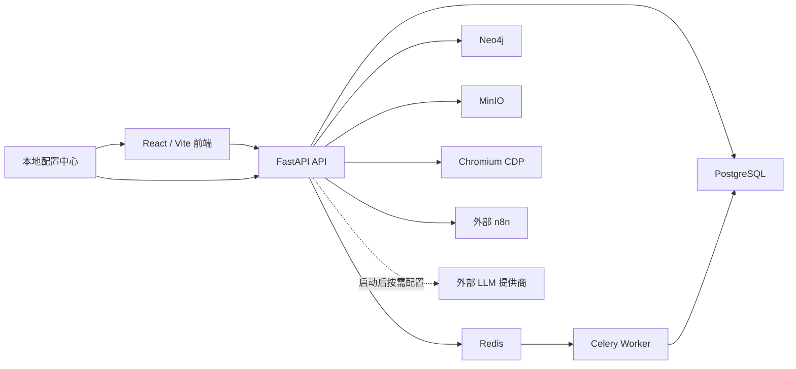

# 系统架构

OntologyBuild 由多个可独立启动但共享业务契约的进程组成。

## 必需运行依赖与失败边界

所有正常启动环境使用同一必需依赖集合：PostgreSQL、Redis、Celery worker、
Neo4j、MinIO 和 n8n 必须真实就绪。Chromium CDP 也必须出现在启动配置并
接受配置阶段的提示性探针；该探针暂时失败不阻止生成配置或启动 API。运行期
不可达时 API 进程仍可保持 liveness，但深度 readiness 必须失败。单独的 API
liveness 不能证明平台可用。

运行时不提供以下静默替代：

- 平台主数据库不从 PostgreSQL 切换到 SQLite；
- Celery 异步入队失败不自动改在 API 进程执行；已有显式同步接口保持其公开语义；
- Neo4j 图读取、投影或分析失败不切换到 NetworkX 或 SQL 图；
- MinIO 写入失败不把新对象写到本地目录；
- n8n 未就绪阻止 API 启动；Chromium CDP 未就绪不终止 API，但阻止深度
  readiness。

ChromaDB 已移除。`/search/keyword` 和统一搜索的 `mode=keyword` 继续使用
PostgreSQL；语义搜索端点及 `mode=semantic` 返回
`501 semantic_search_unsupported`。LLM 是启动后的业务配置：管理员在“模型
配置”页面按需添加，未配置时依赖 LLM 的能力显式失败，但不阻断基础平台启动。

以下 SQLite/本地路径有独立边界，不是平台降级：API Hub 的自有 SQLite、
`ENVIRONMENT=test` 的隔离 SQLite，以及迁移前 `local://` 对象的只读读取/迁移。
旧 NetworkX 进程内图服务已删除；本体推理直接使用关系型事实与规则，不再
初始化第二套图后端。

## 代码边界

- `backend/app/<business-domain>/`：优先的业务能力实现位置；
- `backend/app/shared/`：迁移期公共能力，后续拆为 `core/` 和
  `infrastructure/`；
- `backend/app/tasks/`：后台任务入口，业务规则仍应归属对应业务域；
- `backend/app/routers|models|schemas|services/`：以兼容 facade 为主，仍有
  [例外台账](./backend-modules.md)中的真实实现；
- `frontend/src/features/overview/`：平台概览当前 canonical package；
- `frontend/src/pages|api|components/`：其他前端业务域的当前主要实现位置；
- `frontend/src/app|features|shared/`：逐业务域迁移目标；除 overview 外尚未成为
  全仓当前结构。

## 数据结构管理

当前存在三种 schema 管理路径：

1. 主数据库生产结构由 Alembic 管理；
2. 明确的测试环境使用隔离 SQLite 和 `create_all`；正常开发/生产仍使用
   PostgreSQL；
3. API Hub 使用独立 SQLite 与自身迁移。

任何模型或目录调整都必须分别验证三条路径，不能把测试 SQLite 或 API Hub
SQLite 当作平台主数据库可降级的证据。

## 进一步阅读

- [后端模块边界](./backend-modules.md)
- [统一模块地图](./module-map.md)
- [核心数据流](./data-flow.md)
- [前端路由与权限](./frontend-routing.md)
- [业务域结构 ADR](./adr/0001-business-domain-structure.md)
- [Ontology 参考](../reference/ontology.md)
- [Sentinel Engine](../reference/sentinel-engine.md)
