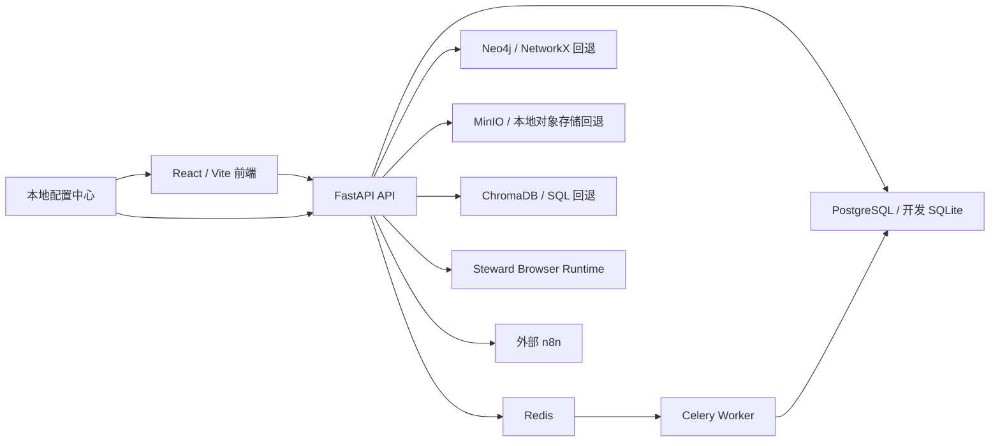

# 系统架构

OntologyBuild 由多个可独立启动但共享业务契约的进程组成。

生产所需依赖和允许的降级模式由环境配置决定。不得把“开发环境能降级启动”
误认为“生产依赖已经验证”。

## 代码边界

- `backend/app/<business-domain>/`：优先的业务能力实现位置；
- `backend/app/shared/`：迁移期公共能力，后续拆为 `core/` 和
  `infrastructure/`；
- `backend/app/tasks/`：后台任务入口，业务规则仍应归属对应业务域；
- `backend/app/routers|models|schemas|services/`：以兼容 facade 为主，仍有
  [例外台账](./backend-modules.md)中的真实实现；
- `frontend/src/features/overview/`：平台概览当前 canonical package；
- `frontend/src/pages|api|components/`：其他前端业务域的当前主要实现位置；
- `frontend/src/app|features|shared/`：逐业务域迁移目标；除 overview 外尚未成为
  全仓当前结构。

## 数据结构管理

当前存在三种 schema 管理路径：

1. 主数据库生产结构由 Alembic 管理；
2. 开发数据库仍有 `create_all` 和兼容修复逻辑；
3. API Hub 使用独立 SQLite 与自身迁移。

任何模型或目录调整都必须分别验证三条路径，不能只验证新建 SQLite 单元测试。

## 进一步阅读

- [后端模块边界](./backend-modules.md)
- [统一模块地图](./module-map.md)
- [核心数据流](./data-flow.md)
- [前端路由与权限](./frontend-routing.md)
- [业务域结构 ADR](./adr/0001-business-domain-structure.md)
- [Ontology 参考](../reference/ontology.md)
- [Sentinel Engine](../reference/sentinel-engine.md)
