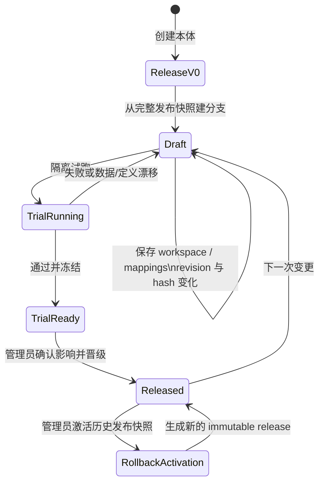

# 核心数据、本体发布与运行时契约（可验证现状基线）

| 字段 | 内容 |
|---|---|
| 状态 | Accepted（现状证据基线，不代表新增产品意图） |
| 日期 | 2026-08-02 |
| 负责人 | 未在仓库可核验来源中声明 |
| 评审人 | 未在仓库可核验来源中声明 |
| 目标版本 | 当前实现；无可核验版本号 |
| 业务域 | 数据通道、本体版本、Formal Runtime、Sentinel、Action |

## 1. 文档边界

本文只记录源码、API 装配和自动化测试能够共同证明的当前契约，用于目录迁移、
重构和发布验收。业务主链分为三个相互衔接但状态独立的流程：

1. 数据生产：数据集版本 → 流水线验证/发布/执行 → 成品数据版本 → 审核；
2. 定义发布：当前发布版 → 草稿 → 隔离试跑 → 影响确认 → 晋级；
3. 发布后刷新：已审核数据版本 → 显式订阅 → Mapping 全量协调 →
   Formal 投影与 Sentinel 屏障。

“事件登记”是独立业务能力，不属于上述运行时 CDC 链路。当前仓库没有可核验的
`RegisteredEvent` 自动转换为 Formal Object/Link 或触发 Sentinel 的接线；不得
根据 `ontology_id` 字段推断已经存在这种自动化。

## 2. 术语与权威状态

| 术语 | 当前权威含义 |
|---|---|
| 数据集版本 | `DatasetVersion` 的不可变、带 checksum 快照 |
| 成品数据审核 | 绑定某一个精确数据集版本的 `CuratedReview` 决策 |
| 当前发布版 | `OntologyProject.current_release_id` 指向的 released `OntologyVersion` |
| 草稿 | 从完整发布快照复制、可递增 revision/hash 的 `OntologyVersion` draft |
| 隔离试跑 | 使用精确数据版本 materialize 到 `OntologyTrialObject/Link`，不写运行投影 |
| Formal 投影 | PostgreSQL `fo_*` 对象、关系、Fact、Action/Sentinel 运行记录 |
| 查询投影 | 可由 PostgreSQL 当前事实重建的 Neo4j 图视图 |
| 运行时 CDC | Formal/Mapping 变更的 durable outbox，不等同于事件登记 |

### 2.1 运行依赖与搜索契约

- 正常启动必须真实配置并验证 PostgreSQL、Redis、Celery worker、Neo4j、
  MinIO 和 n8n；任一未就绪都阻止 API 启动或平台 ready；Chromium CDP 地址
  必须配置，但服务不可达只允许 API 保持 liveness/诊断，深度 readiness 返回
  503；
- PostgreSQL、Celery、Neo4j 和 MinIO 失败时，不得分别切换到平台 SQLite、
  API 线程任务、NetworkX/SQL 图或本地对象存储；
- ChromaDB 与向量投影已移除。PostgreSQL 关键词搜索保留；语义搜索端点和统一
  搜索 `mode=semantic` 返回 `501 semantic_search_unsupported`；
- LLM 不属于启动依赖。管理员在平台启动后从“模型配置”页面按需添加提供商；
- API Hub 自有 SQLite、测试环境 SQLite、历史 `local://` 只读迁移兼容是隔离
  用途，不构成上述运行时降级。

权威发布上下文由
[`release_context.py`](../../../backend/app/ontologies/release_context.py)
解析；治理读取在指针缺失、失效或与调用方预期不一致时返回冲突，不从可变投影
或 `project.status` 猜测版本。

## 3. 数据生产状态门

```text
DatasetVersion
  → Pipeline draft / dry-run
  → 定义校验凭据
  → Pipeline published
  → enabled
  → production run
  → Curated DatasetVersion
  → version-bound review
```

### 3.1 不可变版本与存储

- 每次写入产生新的 `DatasetVersion`；同一数据集的版本号唯一，内容以 checksum
  识别。
- 结构化、半结构化和成品数据的权威快照是 PostgreSQL `data_blob`；
  `storage_uri` 只用于非结构化文件及迁移前历史版本。
- 成品数据集的稳定产物身份是
  `(producer_pipeline_id, output_key)`，名称不是唯一归属依据。

实现：
[`datasets/models.py`](../../../backend/app/data_channel/datasets/models.py)、
[`datasets/service.py`](../../../backend/app/data_channel/datasets/service.py)、
[`pipeline_run.py`](../../../backend/app/tasks/v2/pipeline_run.py)。

### 3.2 流水线发布与执行

- Canvas 流水线发布前必须有与当前定义和 dry-run 对应的校验凭据；修改执行图或
  契约会使旧凭据失效。
- 发布创建不可变 `PipelineVersion` 快照；发布和启用是两个状态。未发布的流水线
  不能启用。
- 生产执行同时要求 `status=published` 和 `enabled=true`；生产环境还校验当前
  定义与已发布快照一致。
- dry-run/preview 是验证入口，不等于生产入湖。

API 实现在
[`pipelines/router.py`](../../../backend/app/data_channel/pipelines/router.py)：
`POST /api/v2/pipelines/{id}/validate-definitions`、`/publish`、`/run`、
`/run-sync`、`/dry-run` 和 `PATCH /enabled`。

### 3.3 成品审核

- 审核绑定精确的 `dataset_version_id`；新的成品版本不能沿用旧版本的 approved
  结论。
- approve/reject 是终态竞争；过期 Session 不能覆盖已经提交的终态。
- 审批通过与 `curated_review_approved` durable event 在同一事务提交。
- 成品审核通过接口只允许管理员；读取和映射仍必须再次验证精确版本已通过。

实现：
[`curated/review_service.py`](../../../backend/app/data_channel/curated/review_service.py)、
[`curated/router.py`](../../../backend/app/data_channel/curated/router.py)。

## 4. 本体定义发布状态门



### 4.1 基线与草稿

- 新建本体时立即创建不可变 `v0` 发布快照并设置 `current_release_id`。
- 草稿从一个完整版本快照复制；普通分支以当前发布版为并发基线。
- workspace 和 mapping 保存使用 `revision:snapshot_hash` 做乐观并发校验；
  任何结构或映射修改都会更新 revision/hash，并使旧试跑失效。
- 发布后的定义和自动化策略不能通过 live mapping API 原地改写；必须进入新的
  版本化草稿。仅明确标注为 operational 的订阅开关可在发布后调整。

### 4.2 隔离试跑

- 试跑只接受 draft，且 draft 的 `base_release_id` 必须仍是当前发布版。
- 试跑验证 Formal 结构、Mapping、内置 Sentinel 和 Action 契约。
- 试跑读取真实、带 checksum 的精确数据集版本，并把结果写入隔离的
  `OntologyTrialObject` / `OntologyTrialLink`；不触发 live Action 或覆盖当前
  Object/Link。
- 通过后的 `trial_ready` 草稿被冻结；继续编辑必须创建新分支。

### 4.3 晋级

`POST /api/v2/ontologies/{ontology_id}/versions/{version_id}/promote`
只允许管理员，并同时要求：

1. draft 为 `trial_ready`，基线仍指向当前发布版；
2. 选择的试跑为 passed；
3. 试跑 revision、snapshot hash 与当前草稿完全一致；
4. 调用方确认的 impact hash 与当前影响分析、试跑记录完全一致；
5. 试跑所固定的数据集版本仍存在，版本/checksum 未漂移；
6. Mapping、内置 Sentinel、Action 和运行态冲突检查全部通过；
7. 试跑对象/关系数量和冻结结果完整。

晋级在同一数据库事务中恢复定义、激活精确试跑 Object/Link、写 Fact lineage、
创建 immutable release 并切换 `current_release_id`。生产环境还必须成功构建
Neo4j 候选图查询投影；任一步失败都会回滚 SQL 事务并尝试恢复当前查询投影。

实现：
[`promotion_service.py`](../../../backend/app/ontologies/versions/promotion_service.py)、
[`runtime_state_service.py`](../../../backend/app/ontologies/versions/runtime_state_service.py)、
[`trial_service.py`](../../../backend/app/ontologies/versions/trial_service.py)、
[`versions/models.py`](../../../backend/app/ontologies/versions/models.py)。

### 4.4 回滚

- 发布节点不可修改，“unpublish”旧入口已返回 410。
- 管理员回滚历史 release 时不会复用旧指针，而是创建一个新的 immutable
  activation release；历史 Fact、Firing、审批继续保留原 release lineage。
- 回滚前重新检查历史定义与当前运行实例兼容，重新计算派生属性，并在生产环境
  把查询投影成功作为事务提交门；失败时当前发布版保持不变。

API：`POST /api/v2/ontologies/{ontology_id}/versions/{version_id}/rollback`。

实现：
[`rollback_service.py`](../../../backend/app/ontologies/versions/rollback_service.py)、
[`runtime_state_service.py`](../../../backend/app/ontologies/versions/runtime_state_service.py)。
HTTP 参数、权限与响应仍由
[`versions/router.py`](../../../backend/app/ontologies/versions/router.py) 适配。

## 5. 发布后数据刷新

```text
Approved Curated Version
  → curated_review_approved outbox
  → 显式 __auto_apply_on_review__ 订阅
  → MappingService.build_all(require_approved=true)
  → Formal Object/Link/Fact commit
  → Sentinel CDC chain barrier
  → event completed
```

- 审核事件采用 claim token、stale reclaim 和 retry 状态；消费者重启后无需从
  `latest_version_id` 猜测意图。
- 只有当前发布快照中的 mapping/link mapping 显式订阅
  `__auto_apply_on_review__` 才会响应成品审核。
- 刷新不是只应用某一行 mapping，而是按 ontology 执行完整
  `build_all(require_approved=true)` 协调，以便删除、关系和派生值也能收敛。
- Mapping 提交后必须注册并通过 Formal/Sentinel CDC 屏障；下游失败不能把上游
  event 标记为成功。
- 用户维护的手工数据集走独立 `__auto_apply_on_version__` 契约；只有存在稳定主键、
  不由连接/流水线维护且版本不可变并带 checksum 时才有资格触发。
- 当前发布 mapping 可以对新批准数据做数据刷新，但 mapping 定义本身仍被冻结。

实现：
[`version_events.py`](../../../backend/app/data_channel/datasets/version_events.py)、
[`incremental_orchestrator.py`](../../../backend/app/data_channel/sync_tasks/incremental_orchestrator.py)、
[`mapping_apply.py`](../../../backend/app/tasks/v2/mapping_apply.py)、
[`mapping_service.py`](../../../backend/app/ontologies/mappings/mapping_service.py)。

## 6. Sentinel 与 Action 发布围栏

- 内置 Sentinel 的结构定义只来自当前 immutable release snapshot；live row 只承载
  enabled、muted、last scan 等运行状态。
- 助手动态 Sentinel 是独立 overlay：必须为 published、绑定精确
  `current_release_id`、试跑通过且未 retired。
- 手动、对象变化、关系变化、定时扫描和发布/启用控制事件最终都在精确 release
  上执行；捕获后发布指针变化会使旧事件 stale，不会跨版本继续 Action 链。
- Action 支持 dry-run、参数/规则校验、稳定 idempotency key 和 release lineage。
  `requires_approval` 的真实执行先写 pending 审批，管理员决定后从持久化 lineage
  恢复；重试不得重复已成功的步骤。
- Webhook 是真实受限 HTTP 出站，不是“仅记录”；网络失败会回滚本地事务。远端
  已接收但本地未知时明确记录 `delivery_uncertain`，依赖 delivery idempotency
  key 对账。

实现：
[`sentinels/engine.py`](../../../backend/app/ontologies/sentinels/engine.py)、
[`sentinels/cdc.py`](../../../backend/app/ontologies/sentinels/cdc.py)、
[`action_engine.py`](../../../backend/app/ontologies/formal_modeling/action_engine.py)。

## 7. 权限与外部契约

| 操作 | 当前可核验边界 |
|---|---|
| 数据通道 API | 由 `data.*` menu guard 保护；具体读写共享规则见 0001 契约 |
| 成品 approve/reject | `require_admin` |
| 本体读写 API | 由 `ontologies` menu guard 保护 |
| promote / rollback | `require_admin` |
| Action 审批决定 | 管理员端点 |
| 事件登记管理 | `events` menu guard |
| 第三方事件 ingest | 独立 `X-API-Key`，不是用户 JWT，也不是 Sentinel CDC |

纯目录整理不得改变 HTTP 路径、状态码、OpenAPI operation、menu key、数据库表/
约束、Alembic revision、Celery task name、outbox 状态或幂等键语义。

## 8. 幂等、失败与恢复矩阵

| 边界 | 去重/并发依据 | 失败行为 |
|---|---|---|
| 数据集版本 | `(dataset_id, version_no)`、checksum、写锁 | 不覆盖既有版本 |
| 成品产物 | `(producer_pipeline_id, output_key)` | 歧义时失败，不按名称猜归属 |
| 数据版本 event | `(dataset_version_id, event_type)`、claim token | retry/stale reclaim，claim owner CAS |
| 草稿保存 | `revision:snapshot_hash` | 409，要求刷新 |
| 试跑 | draft/revision/hash/base release、数据版本 pins | 漂移即 stale，重新试跑 |
| promote | project row + ontology build lock、impact hash | 写入前冲突停止；事务失败整体回滚 |
| rollback | 历史 snapshot + 新 activation id | 验证/投影失败保持当前 release |
| Sentinel CDC | release id、event kind、claim token、chain/checkpoint | retry/dead 可观测；旧 release 事件 stale |
| Action | request idempotency key、release/action/target/parameters | success/pending 可回放；冲突 fail closed |
| Celery 异步调度 | Redis broker、已注册 task、worker readiness | 入队/worker 不可用即失败，不自动切到 API 线程；显式同步接口保持原语义 |
| 图/对象存储 | Neo4j、MinIO readiness | 返回明确失败，不切换内存/SQL 图或本地目录 |
| 搜索 | 显式 keyword/semantic mode | keyword 使用 PostgreSQL；semantic 返回 501 |

## 9. 证据矩阵

| 契约 | 实现证据 | 可执行证据 |
|---|---|---|
| 数据库/MinIO 存储边界 | [`datasets/models.py`](../../../backend/app/data_channel/datasets/models.py) | [`test_storage_hardening.py`](../../../backend/tests/v2/datasets/test_storage_hardening.py) |
| Pipeline 发布凭据与启用门 | [`pipelines/router.py`](../../../backend/app/data_channel/pipelines/router.py) | [`test_pipeline_publish_attestation.py`](../../../backend/tests/v2/pipeline/test_pipeline_publish_attestation.py) |
| 成品版本审核 | [`review_service.py`](../../../backend/app/data_channel/curated/review_service.py) | [`test_review_flow.py`](../../../backend/tests/v2/curated/test_review_flow.py) |
| Draft/workspace | [`workspace_service.py`](../../../backend/app/ontologies/versions/workspace_service.py) | [`test_ontology_evolution.py`](../../../backend/tests/ontologies/test_ontology_evolution.py) |
| Trial | [`trial_service.py`](../../../backend/app/ontologies/versions/trial_service.py) | [`test_ontology_evolution.py`](../../../backend/tests/ontologies/test_ontology_evolution.py) |
| Promote | [`promotion_service.py`](../../../backend/app/ontologies/versions/promotion_service.py)、[`runtime_state_service.py`](../../../backend/app/ontologies/versions/runtime_state_service.py) | [`test_ontology_evolution.py`](../../../backend/tests/ontologies/test_ontology_evolution.py) |
| Rollback | [`rollback_service.py`](../../../backend/app/ontologies/versions/rollback_service.py) | [`test_ontology_evolution.py`](../../../backend/tests/ontologies/test_ontology_evolution.py) |
| Mapping 不能绕过发布 | [`mappings/router.py`](../../../backend/app/ontologies/mappings/router.py) | [`test_data_mapping_bridge_e2e.py`](../../../backend/tests/v2/mapping/test_data_mapping_bridge_e2e.py) |
| 发布后 durable refresh | [`version_events.py`](../../../backend/app/data_channel/datasets/version_events.py) | [`test_version_automation_events.py`](../../../backend/tests/v2/datasets/test_version_automation_events.py) |
| Mapping 完整协调/失败恢复 | [`mapping_service.py`](../../../backend/app/ontologies/mappings/mapping_service.py) | [`test_runtime_hardening.py`](../../../backend/tests/v2/mapping/test_runtime_hardening.py) |
| Mapping → Sentinel 屏障 | [`sentinels/cdc.py`](../../../backend/app/ontologies/sentinels/cdc.py) | [`test_mapping_sentinel_dispatch.py`](../../../backend/tests/v2/mapping/test_mapping_sentinel_dispatch.py) |
| Sentinel release fence | [`sentinels/engine.py`](../../../backend/app/ontologies/sentinels/engine.py) | [`test_sentinel_release_fence.py`](../../../backend/tests/ontologies/test_sentinel_release_fence.py) |
| Action/HITL/Webhook | [`action_engine.py`](../../../backend/app/ontologies/formal_modeling/action_engine.py) | [`test_execution_runtime_hardening.py`](../../../backend/tests/ontologies/test_execution_runtime_hardening.py) |
| Event Registry 独立边界 | [`events/router.py`](../../../backend/app/events/router.py) | [`test_events.py`](../../../backend/tests/events/test_events.py) |
| 用户可见供应链 | 前后端上述实现组合 | [`pipeline_ontology_supply_chain.spec.ts`](../../../frontend/src/test/e2e/pipeline_ontology_supply_chain.spec.ts) |

## 10. 目录迁移验收

涉及本文任一模块的移动或重构，至少必须证明：

1. 三个流程的状态门、权限和外部 API 契约无意外 diff；
2. 当前 release、数据版本 pin、Fact/Firing/Action lineage 没有丢失；
3. durable event/CDC 的 claim、retry、dead/stale 与幂等行为不变；
4. PostgreSQL 新库和现存副本迁移可运行，只有一个 Alembic head；
5. 后端完整回归、前端分类/lint/build/mocked E2E 通过；
6. 涉及 PostgreSQL、Redis/Celery worker、Neo4j、MinIO、n8n、Chromium CDP、
   发布或回滚时，在隔离真实栈补充供应链与失败恢复证据。

关联：
[导航与 RBAC 契约](./0001-current-platform-contract.md)、
[核心数据流](../../architecture/data-flow.md)、
[当前治理迭代](../../iterations/2026/2026-07-30-repository-governance.md)。
