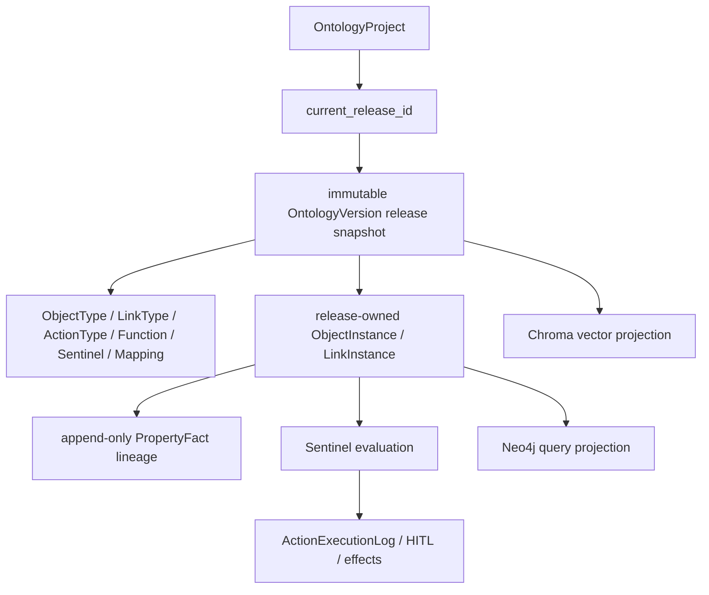

# Ontology 当前实现参考

本文是当前 Ontology 实现的下钻入口，不是行业通用本体设计稿。当前事实以
PostgreSQL 模型、版本路由、Mapping 服务和自动化测试为准；历史 MongoDB、
TuGraph 或特定医疗场景方案不属于本项目现行架构。

先读：
[产品概览](../product/overview.md) →
[核心数据流](../architecture/data-flow.md) →
[核心运行契约](../product/requirements/0002-core-data-ontology-runtime-contract.md)。

## 1. 当前心智模型

必须区分三层：

1. **发布定义**：不可变 `OntologyVersion.snapshot_formal`；
2. **当前运行投影**：PostgreSQL `fo_*` 表中的对象、关系和执行状态；
3. **查询投影**：Neo4j/ChromaDB，可从前两层重建。

`OntologyProject.current_release_id` 是唯一权威发布指针。`project.status`、
兼容 `version` 字段、可变 `fo_*` 定义投影或外部查询库都不能替代它。

## 2. PostgreSQL 模型

### 2.1 项目与版本

| 模型/表 | 责任 |
|---|---|
| `OntologyProject` / `ontology_projects` | 项目元数据和 `current_release_id` |
| `OntologyVersion` / `ontology_versions` | 完整 draft/release 快照树 |
| `OntologyTrialRun` / `ontology_trial_runs` | 固定 revision/hash/base release/data pins 的试跑 |
| `OntologyTrialObject` / `ontology_trial_objects` | 隔离试跑对象投影 |
| `OntologyTrialLink` / `ontology_trial_links` | 隔离试跑关系投影 |

`OntologyVersion` 每个节点保存完整快照，不依赖增量祖先重放：

- `node_kind`: `draft | release`；
- `lifecycle_status`: `editing | trial_ready | released | superseded`；
- `revision` + `snapshot_hash`: 草稿并发和试跑冻结依据；
- `parent_version_id`, `base_release_id`, `promoted_from_id`: 分支与发布 lineage；
- `snapshot_formal`: Formal 定义、Mapping 和内置 Sentinel 的发布快照；
- `canvas_layout`: 展示元数据，不参与定义 hash。

实现：
[`projects/models.py`](../../backend/app/ontologies/projects/models.py)、
[`versions/models.py`](../../backend/app/ontologies/versions/models.py)。

### 2.2 Formal 定义与运行投影

| 表 | 当前含义 |
|---|---|
| `fo_object_types` | 对象类型、属性、主键和 schema lineage |
| `fo_link_types` | 两端对象类型、基数、角色和关系属性 |
| `fo_action_types` | Action 参数、规则、校验函数和 HITL 开关 |
| `fo_functions` | 派生、Action 校验和查询函数 |
| `fo_object_instances` | 当前对象投影，带 `ontology_release_id` |
| `fo_link_instances` | 当前关系投影，带 `ontology_release_id` |
| `fo_property_facts` | append-only 属性/派生/存在性/关系/决策/缺席事实 |
| `fo_action_logs` | Action、审批、幂等与效果审计 |

正式模型定义在
[`formal_modeling/models.py`](../../backend/app/ontologies/formal_modeling/models.py)。
数据库中仍有旧 Entity/Relation/Logic/Action 兼容投影；它们不是新增功能的
canonical 建模边界，迁移规则见
[后端模块边界](../architecture/backend-modules.md)。

## 3. 定义生命周期

### 3.1 创建与读取

新建项目时
[`create_initial_release()`](../../backend/app/ontologies/release_context.py)
创建完整空 `v0` release，并设置 `current_release_id`。治理 API 使用
`current_release_context()`：

- 指针缺失或未指向 released 节点时 fail closed；
- 调用方传入 `expected_release_id` 时执行 compare-and-read；
- 返回定义来自 immutable snapshot，不从 live 表拼凑。

### 3.2 Draft

草稿从完整版本快照复制。结构和 Mapping 保存都校验
`revision:snapshot_hash`；成功后 revision/hash 更新，旧试跑变 stale。
当前读取入口包括：

- `GET /api/v2/ontologies/{id}/current-release/workspace`
- `GET /api/v2/ontologies/{id}/current-release/mappings`
- `POST /api/v2/ontologies/{id}/versions/{source}/drafts`
- `PUT /api/v2/ontologies/{id}/versions/{draft}/workspace`
- `PUT /api/v2/ontologies/{id}/versions/{draft}/workspace/mappings`

### 3.3 Trial

`POST .../versions/{draft}/trial-runs`：

1. 校验 draft 基线仍是当前 release；
2. 验证 Object/Link/Action/Function/Mapping/Sentinel 定义；
3. 固定 Mapping 实际读取的 DatasetVersion id/checksum；
4. materialize 完整 `OntologyTrialObject/Link`；
5. 在隔离数据上计算派生属性和 Action preview；
6. 不写 live Object/Link，不执行真实副作用；
7. 通过后把 draft 置为 `trial_ready` 并冻结。

运行中的试跑有 single-flight claim 与 lease；晚到 worker 不能覆盖已漂移草稿的
终态。

### 3.4 Promote

管理员 promote 重新检查：

- `trial_ready`、passed trial、revision/hash；
- 当前 base release、impact hash；
- DatasetVersion pins/checksums；
- Mapping/Sentinel/Action 发布契约；
- 试跑 materialization 完整性；
- 试跑候选与当前非湖运行事实之间的冲突。

通过后在同一 SQL 事务中恢复 Formal 定义、激活试跑 Object/Link、写
PropertyFact lineage、创建新 release、更新指针并使旧 draft superseded。
production 还要求 Neo4j/Chroma 候选投影 ready；失败则 SQL 回滚并重建旧查询
投影作为补偿。

### 3.5 Rollback

历史 release 不会重新变成“当前旧节点”。管理员调用
`POST .../versions/{release}/rollback` 后：

1. 恢复历史定义；
2. 校验它与当前运行实例兼容；
3. 创建新的 immutable activation release；
4. 把保留的 Object/Link 绑定到新 activation；
5. 重算派生属性并保留既有历史 Fact/Firing/Approval lineage；
6. production 查询投影 ready 后才提交。

因此，回滚也是一次新的发布事件，审计和版本号不会倒退。

生命周期已经按职责拆入 canonical service：

| 职责 | 实现 |
|---|---|
| 发布快照与当前 release 解析 | [`release_service.py`](../../backend/app/ontologies/versions/release_service.py) |
| 版本树、draft 与 workspace/mapping 编辑 | [`workspace_service.py`](../../backend/app/ontologies/versions/workspace_service.py) |
| 隔离试跑、claim/lease 与终态提交 | [`trial_service.py`](../../backend/app/ontologies/versions/trial_service.py) |
| 数据 pin、运行态冲突与发布 readiness | [`runtime_state_service.py`](../../backend/app/ontologies/versions/runtime_state_service.py) |
| 晋级事务 | [`promotion_service.py`](../../backend/app/ontologies/versions/promotion_service.py) |
| 历史快照激活与回滚事务 | [`rollback_service.py`](../../backend/app/ontologies/versions/rollback_service.py) |

[`versions/router.py`](../../backend/app/ontologies/versions/router.py) 是 HTTP/权限
适配层，不再是生命周期规则的集中位置。主要可执行证据见
[`test_ontology_evolution.py`](../../backend/tests/ontologies/test_ontology_evolution.py)
及 [`tests/architecture/`](../../backend/tests/architecture/) 的 versions 边界
守卫。

## 4. 数据 Mapping 与运行投影

对象映射使用 `v2_ontology_mappings`，关系映射使用
`v2_ontology_link_mappings`：

- 对象映射绑定 Dataset、ObjectType、字段/主键策略；
- 关系映射可使用 source/target 数据集的“瘦关系”，或额外 edge dataset 的
  “胖关系”；
- 发布快照冻结定义和自动化策略；
- `MappingService.build_all(ontology_id, require_approved=true)` 按本体完整协调
  Object、Link、删除/tombstone、派生属性和 Fact，不是仅追加当前数据；
- 成品数据必须是精确版本 approved；
- `__auto_apply_on_review__` 和 `__auto_apply_on_version__` 是不同触发契约。

Mapping 应用与发布/Action 共用 ontology build lock，避免投影被并发定义切换或
运行写入覆盖。Formal 投影提交后，Sentinel CDC 屏障必须成功，才可把上游刷新
标记成功。

实现：
[`mappings/models.py`](../../backend/app/ontologies/mappings/models.py)、
[`mapping_service.py`](../../backend/app/ontologies/mappings/mapping_service.py)、
[`formal_projection.py`](../../backend/app/ontologies/mappings/formal_projection.py)。

## 5. Fact 与因果 lineage

`fo_object_instances.properties/computed` 是当前态；`fo_property_facts` 是
append-only 历史：

- `kind`: property、derived、link、object、decision、absence；
- `source`: editor、mapping/release、action 等来源；
- `actor_id`: 有人参与时的身份；
- `caused_by`: Action log、trial/release 或上游事件等因果指针；
- `supersedes_id`: 同一事实坐标被替代的前一条；
- `derived_from`: 派生事实的输入 Fact ids；
- `ontology_release_id`: 产生该事实的 immutable release；
- `seq` + `recorded_at`: 同坐标确定性顺序。

无法证明 release 的 legacy NULL lineage 不会被猜入当前发布治理视图。Action、
Sentinel firing、match state 和审批也保存 release id，避免 v1 的待审批动作在
v2 发布后执行。

Fact 写入集中在
[`formal_modeling/facts.py`](../../backend/app/ontologies/formal_modeling/facts.py)；
Action/Sentinel 细节见
[Sentinel Engine 当前实现](./sentinel-engine.md)。

## 6. 查询投影

| 系统 | 用途 | 权威性 |
|---|---|---|
| PostgreSQL | 发布、定义、运行实例、Fact、outbox、审计 | 权威 |
| Neo4j | 当前对象/关系图查询 | 可重建投影 |
| ChromaDB | 当前发布内容的向量检索 | 可重建投影 |

生产 promote/rollback 把两种查询投影的 ready 状态当作发布门，是为了防止对外
暴露半切换版本；这不意味着图或向量库成为主事实。Redis/Celery 也只负责传输、
调度和执行，不拥有发布状态。

## 7. API 与代码入口

| 能力 | 当前入口 |
|---|---|
| 项目 CRUD | `/api/v1/ontologies` |
| 版本、workspace、trial、promote/rollback | `/api/v2/ontologies` |
| Formal 定义、实例、Action、Fact、统计 | `/api/v2/formal/ontologies` |
| Mapping 与图/搜索等 v2 能力 | `/api/v2/ontologies` |
| Sentinel | `/api/v1/ontologies/{id}/sentinels` |

FastAPI 的真实装配以
[`backend/app/main.py`](../../backend/app/main.py) 为准。目录定位与测试入口见
[统一模块地图](../architecture/module-map.md)。

## 8. 维护约束

修改 Ontology 实现时不得：

- 绕过 `current_release_id` 从 live 表推断发布定义；
- 在 published 项目上原地改变 Mapping/Sentinel 结构；
- 用最新数据集指针替代 trial 固定版本；
- 把 Neo4j/ChromaDB 当主事实；
- 复用历史 release id 做回滚；
- 让 Action、Sentinel 或审批跨 release 延续；
- 只测试成功路径而不覆盖并发、重试、漂移与投影失败。

最小证据集：
[`test_ontology_evolution.py`](../../backend/tests/ontologies/test_ontology_evolution.py)、
[`test_data_mapping_bridge_e2e.py`](../../backend/tests/v2/mapping/test_data_mapping_bridge_e2e.py)、
[`test_runtime_hardening.py`](../../backend/tests/v2/mapping/test_runtime_hardening.py)、
[`test_sentinel_release_fence.py`](../../backend/tests/ontologies/test_sentinel_release_fence.py)。
