# Sentinel Engine 当前实现参考

Sentinel Engine 在一个精确的 immutable Ontology release 上匹配对象/关系状态，
维护进入/离开集合，并执行受 release fence、幂等和审批约束的 Action。本文只
描述当前实现；业务主链和存储边界见
[核心数据流](../architecture/data-flow.md) 与
[核心运行契约](../product/requirements/0002-core-data-ontology-runtime-contract.md)。

## 1. 运行边界

```mermaid
flowchart LR
  Input["手动 / Object CDC / Link CDC /\n定时 / 发布与启用控制事件"]
  Input --> Release["解析 exact current_release_id"]
  Release --> Definitions["release built-ins + exact-release dynamic overlay"]
  Definitions --> Match["对象/关系 tuple + condition"]
  Match --> State["SentinelMatchState\nedge / epoch / retry state"]
  State --> Firing["SentinelFiring"]
  Firing --> Action["Action Engine"]
  Action --> Outcome["success / pending HITL / failed"]
  Outcome --> Barrier["durable chain barrier"]
```



运行入口首先调用
[`current_release_context()`](../../backend/app/ontologies/release_context.py)。
指针缺失、无效或已变化时 fail closed；不会回退到可变定义或仅凭版本字符串继续
执行。

## 2. 两类 Sentinel

### 2.1 Release built-in

内置 Sentinel 是本体发布定义的一部分：

- 结构字段只从当前 `OntologyVersion.snapshot_formal.sentinels` materialize；
- live `sentinels` row 只作为运行状态载体；
- live row 必须为 `origin=release_builtin`、`status=published` 才能覆盖
  enabled/muted；
- draft/live row 的结构漂移、缺失或变回 draft 都不能重写当前 release 定义；
- 运行记录、Firing、Match State 和 Action 都绑定 release id。

live 运行 overlay 包括 enabled、muted、last scanned、enable generation 等状态。
`PATCH /api/v1/ontologies/{id}/sentinels/{sentinel_id}/operational-state`
同时 compare-and-set：

1. 调用方的 `expected_release_id`；
2. Sentinel 的 `expected_generation`。

重新启用或解除静默会写 durable `builtin_activation` 事件，保证现存匹配不会被
静默吞掉。

### 2.2 Assistant dynamic overlay

动态 Sentinel 不写进 immutable release snapshot，是当前 release 上的独立
助手 overlay。进入运行集合必须同时满足：

- `origin=assistant_dynamic`；
- `status=published`、enabled；
- `bound_release_id` 等于精确当前 release；
- 定义 revision/hash 与通过的动态试跑一致；
- 未 retired。

发布新 release 会使旧 overlay 失效；运行前 reconcile 或 activation 仍会重新
验证 generation 和绑定，不把旧助手定义带到新版本。

边界实现：
[`engine.py`](../../backend/app/ontologies/sentinels/engine.py)、
[`evaluator.py`](../../backend/app/ontologies/sentinels/evaluator.py)、
[`dynamic_service.py`](../../backend/app/ontologies/sentinels/dynamic_service.py)。

## 3. 执行入口

| 入口 | 当前行为 | durable outbox |
|---|---|---:|
| `POST .../sentinels/run` / `run_manual` | 已认证用户手动评估当前 release 下全部可运行 Sentinel | 否，调用内同步执行 |
| `run_for_change` | 对象变化，筛选引用相应 ObjectType 的 on-change Sentinel | 是 |
| `run_for_link_change` | 关系变化，评估依赖关系的 on-change Sentinel | 是 |
| `scheduled_scan` | 到期 Sentinel 的扫描事件；成功后推进 watermark | 是 |
| `release_activation` | 新 release 首次初始化 built-ins | 是 |
| `dynamic_activation` | 动态 Sentinel 发布/启用初始化 | 是 |
| `builtin_activation` | 内置 Sentinel 启用/解除静默初始化 | 是 |

Object/Link 变化在数据库事务中捕获；Mapping 投影尚未完成时事件保持 held，只有
对应 Mapping applied fence 成立后才可执行。发布指针切换也在同一事务捕获
`release_activation`。

公开执行函数见
[`engine.py`](../../backend/app/ontologies/sentinels/engine.py)，事务捕获、调度和
worker 见
[`cdc.py`](../../backend/app/ontologies/sentinels/cdc.py)。

## 4. Durable outbox

`SentinelCdcOutbox` 保存：

- ontology、精确 `ontology_release_id`、Sentinel 与 event kind；
- ObjectType/变更属性或 Link change 上下文；
- mapping applied fence、chain/root/cascade lineage；
- event generation、definition hash 和控制事件 checkpoint；
- claim token、attempts、available/claimed/processed 时间；
- result、last error 和 dedupe key。

当前 event kind：

`object_change`、`link_change`、`release_activation`、`scheduled_scan`、
`dynamic_activation`、`builtin_activation`。

当前状态族：

| 状态 | 含义 |
|---|---|
| `held` / `cdc_held` | 等待 Mapping/事务围栏 |
| `pending` / `cdc_pending` | 可被 worker claim |
| `processing` / `cdc_processing` | 由 claim token 的 owner 执行 |
| `retry` / `cdc_retry` | 失败后按 available_at 重试 |
| `completed` | 终态成功、无操作或 superseded |
| `dead` / `cdc_dead` | 达到恢复上限，保留错误供运维处理 |

`cdc_*` 是协议隔离状态，用于滚动部署时避免旧 worker 误领新协议事件，不是另一套
业务流程。

### 4.1 Claim 与重试

- claim 使用 compare-and-set 和随机 token；只有 token owner 能提交终态；
- stale processing 可被重新 claim，旧 owner 不能覆盖后继结果；
- 重试沿用控制事件 checkpoint、Match State epoch 和 Action idempotency；
- 同一 release/control generation 的成功执行会被复用；
- release 已切换时旧事件记录为 superseded/stale，不跨版本执行；
- dead letter 和最后错误通过 authenticated `GET .../sentinels/cdc-status`
  可观测，默认聚焦当前 release，历史必须显式请求。

### 4.2 Mapping 与级联屏障

Mapping/Action 可以在提交 Formal 变化后产生下一层 CDC。上游任务只有在同一
chain 的下游事件成功后才算完成：

```text
Mapping event
  → Formal commit
  → object/link CDC
  → Sentinel
  → Action mutation
  → cascade CDC
  → chain barrier success
```

任一层逻辑错误、Action 失败或 dead event 都会向上游暴露；不能以一次手工 scan
掩盖 durable 失败。

模型：
[`sentinels/models.py`](../../backend/app/ontologies/sentinels/models.py)；
执行：
[`sentinels/cdc.py`](../../backend/app/ontologies/sentinels/cdc.py)。

## 5. 匹配与触发模式

Evaluator 从当前 release 的 Object/Link 定义和 release-owned runtime instances
构建候选 tuple，验证所有声明关系，再计算 condition。表达式错误、关系定义
缺失或候选上限溢出都产生错误，不制造假的 leave edge，也不消费 Match State。

| `trigger_mode` | 当前语义 |
|---|---|
| `on_enter` | 只对首次进入匹配集合执行；默认 |
| `on_enter_leave` | 进入和离开分别执行；离开可使用冻结 target snapshot 做受限动作 |
| `run_on_all` | 每轮对所有当前命中执行；每轮递增 epoch |

`SentinelMatchState` 记录稳定 tuple key、matched、runtime status、edge/epoch 和动作
进度。只有 completed 才消费一次 on-enter edge；pending、processing、failed
仍可恢复。`run_on_all` 崩溃重试沿用原 epoch，新一轮才生成新的幂等身份。

`muted` 会保留可观察结果但不应静默消费将来的进入事件；disable/re-enable 会建立
新的 activation lifecycle。

实现与安全测试：
[`evaluator.py`](../../backend/app/ontologies/sentinels/evaluator.py)、
[`test_sentinel_evaluator_safety.py`](../../backend/tests/ontologies/test_sentinel_evaluator_safety.py)。

## 6. Action Engine

Sentinel 与手工 `POST /api/v2/formal/ontologies/{id}/run-action` 共用
[`action_engine.py`](../../backend/app/ontologies/formal_modeling/action_engine.py)。
执行始终固定：

- current release id；
- released Action 定义；
- target Object/Link 与参数；
- Sentinel match/edge lineage（若由 Sentinel 触发）；
- request/action-step/webhook delivery idempotency keys。

### 6.1 校验与效果

当前 Action 规则包括校验、创建/更新/删除对象、创建/删除关系、通知与 Webhook。
执行前验证参数类型、必填值、Action/规则函数类型、Formal schema、Mapping
projection 状态和 release fence。

dry-run/preview 计算完整候选效果但不写数据库、不发网络请求。真实本地变更、
Fact 和内部通知在事务中提交；失败会回滚并把审计效果标记为 rolled back。

### 6.2 HITL

`ActionType.requires_approval=true` 时：

1. 真实请求先写 `ActionExecutionLog(status=pending)`；
2. 日志保存 release id、target snapshot、参数、match state 和 idempotency key；
3. 管理员调用
   `POST /api/v2/formal/ontologies/{id}/action-logs/{log_id}/decide`；
4. reject 写决策 Fact 并释放可重试状态；
5. approve 先持久化人的决定和 `executing` checkpoint，再在独立执行事务中恢复；
6. 进程中断后重复 approve 通过同一稳定 key 恢复，不重复业务副作用；
7. pending v1 动作不能在 v2 成为当前 release 后执行。

批准后的技术执行失败不会伪装成 approved-success；人的决定事实与失败执行日志
分别保留。

### 6.3 Webhook

Webhook 是真实出站 HTTP：

- preview 不解析远端 DNS、不发请求；
- 真实执行限制目标、渲染 JSON、携带稳定 delivery identity 并按策略重试；
- Webhook 在本地 commit 前执行，明确失败会回滚此前本地规则；
- 远端可能已接收但响应不可确认时记录 `delivery_uncertain`，因为远端副作用无法
  随 SQL 回滚；运维必须按 idempotency key 对账；
- 每条 Webhook rule 有不同且稳定的 delivery key。

实现：
[`webhook_dispatcher.py`](../../backend/app/ontologies/formal_modeling/webhook_dispatcher.py)；
验证：
[`test_execution_runtime_hardening.py`](../../backend/tests/ontologies/test_execution_runtime_hardening.py)。

## 7. 运维观察

| 观察面 | API/字段 |
|---|---|
| 最近 firing | `GET .../sentinels/firings` |
| 内部通知 | `GET .../sentinels/notifications` |
| durable queue、retry/dead | `GET .../sentinels/cdc-status` |
| 待审批/恢复 Action | `GET /api/v2/formal/ontologies/{id}/pending-actions` |
| Action/Fact 自治统计 | Formal `overview`、`facts/recent`、`autonomy`、`logs` |

CDC status 只表示指定 ontology/release 的 durable dispatch 健康；它不替代 Celery、
Redis、数据库和外部 Webhook 的系统级监控。

## 8. 不可破坏的契约

重构 Sentinel/Action 时必须保持：

1. built-in 定义来自 immutable release，dynamic overlay 精确绑定 release；
2. Object 与 Link CDC 都进入 durable outbox；
3. control event generation、schedule watermark、claim token 和 dead letter 可恢复；
4. publish/mapping/action 与 Sentinel 使用同一 release/lock 顺序；
5. on-enter edge、run-on-all epoch 和多 Action step 的幂等身份稳定；
6. HITL 决策、执行结果、Fact 和 Firing 保留 release/causal lineage；
7. Webhook 不报告虚假成功，delivery uncertainty 明确可对账；
8. API 路径、event kind、状态名、Celery task name 和数据库约束不随目录移动改变。

最小回归证据：

- [`test_sentinel_release_fence.py`](../../backend/tests/ontologies/test_sentinel_release_fence.py)
- [`test_sentinel_evaluator_safety.py`](../../backend/tests/ontologies/test_sentinel_evaluator_safety.py)
- [`test_mapping_sentinel_dispatch.py`](../../backend/tests/v2/mapping/test_mapping_sentinel_dispatch.py)
- [`test_execution_runtime_hardening.py`](../../backend/tests/ontologies/test_execution_runtime_hardening.py)
